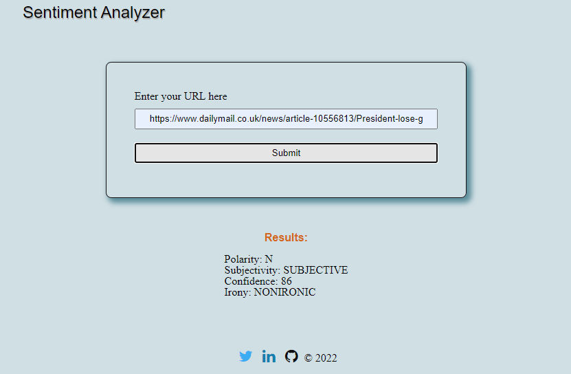

# Project 4: Evaluate a News Article with Natural Language Processing

## Table of contents
* [Overview](#overview)
* [Preview](#preview)
* [Getting Started](#getting-started)
* [Setup server](#setup-server)
* [Testing the code with Jest](#testing-the-code-with-jest)
* [Service Workers](#service-workers)

## Overveiw

This project is part of Udacity's Front End Development Nanodegree. From the course:

The goal of this project is to give you practice with:
* Setting up Webpack
* Sass styles
* Webpack Loaders and Plugins
* Creating layouts and page design
* Service workers
* Using APIs and creating requests to external urls
> Natural language processing (NLP) is a subfield of computer science, information engineering, and artificial intelligence
concerned with the interactions between computers and human (natural) languages, in particular how to program computers to process and analyze large amounts of natural language data.

## Preview

### Getting Started

Fork the project Github repo, and then clone or download the zip file locally. Once you have the project locally, navigate to the project directory to install all dependencies.

Remember that once you clone, you will still need to install everything:

`cd` into your new folder and run: 
`npm install`

Install the following loaders and plugins:

`npm i -D @babel/core @babel/preset-env babel-loader`
`npm i -D style-loader node-sass css-loader sass-loader`
`npm i -D clean-webpack-plugin`
`npm i -D html-webpack-plugin`
`npm i -D mini-css-extract-plugin`
`npm i -D optimize-css-assets-webpack-plugin terser-webpack-plugin`

### Signup for an API key
First, you will need to go [here](https://www.meaningcloud.com/developer/login). Signing up will get you an API key. 
At the root of the project, create a new file named `.env`. Inside the file, add your personal API key:

`API_KEY=**************************`

### Setup server

Use the following command to start the developer server. This should open a new window in your browser with the app running on `localhost:8080`

`npm run build-dev`

To run the production server, run these commands:

`npm run build-prod`
`npm run start`

### Testing the code with Jest

Install Jest 

`npm install --save-dev jest`

You can find test files in the folder called _test_ in the root of the project.

To run test, use the command:

`$ npm run test`

### Service Workers

Service workers are installed in order for the project to be available when server is stopped.
